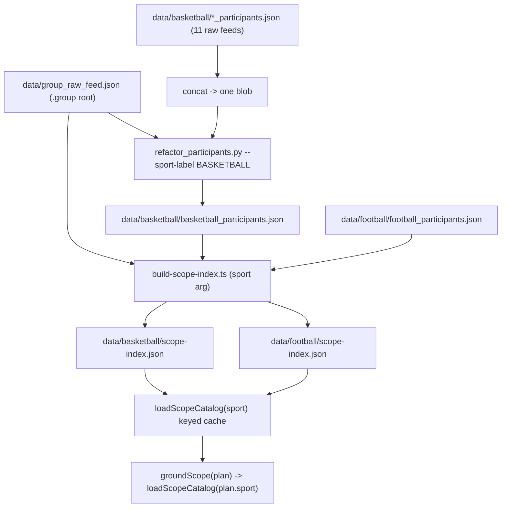

# Add basketball as a second grounded sport

Three stages: **(1) Data decoration** produces basketball's artifacts (and re-points football at the shared multi-sport tree); **(2) Wiring** makes the build script, catalog loader, and grounder sport-agnostic and config-driven so both sports run identical code; **(3) Sport routing** lets the extractor pick the sport, with a soft clarify when it's ambiguous or names an unbuilt sport.

## Key facts established

- `data/group_raw_feed.json` is a **shallow** multi-sport tree wrapped as `{ group: <root> }`. It lists 38 top-level sports but carries only ~179 football nodes vs 1950 in `data/football/groups.json`. **It is not the full tree for football.** It IS complete for basketball (all 22 basketball nodes are present). It is used only by `refactor_participants.py` for sport-subtree classification (where its shallowness matches the sparse basketball tree).
- `data/football/groups.json` is a multi-sport synthetic-root tree (`{ id: 1, sport: "NOT-SPECIFIED", groups: [...9 top-level sports incl. Football...] }`) with the full 1950-node football competition hierarchy. It is NOT replaceable by `group_raw_feed.json` for football builds.
- **Per-sport groups files**: each sport will have `data/<sport>/groups.json` in the same `{ id: 1, sport: "NOT-SPECIFIED", groups: [<sport-root>] }` shape. `data/basketball/groups.json` was extracted from `group_raw_feed.json`'s basketball subtree (22 nodes, complete). This is what `build-scope-index.ts` reads in Stage 2 (Step 7).
- `football_participants.json` is already a refactored artifact; the basketball files are raw Kambi feeds (`{ participants[], range }`) — the equivalent of the raw input that fed the normalizer.
- The normalizer `scripts/football/refactor_participants.py` is sport-agnostic in its **flags** (`--sport-label`/`--sport-slug`, sport-wide blob) but carries football-shaped **heuristics** (national-team naming + `countryTeamId` back-fill, international-tournament header lists). The jq gates catch gross breakage; basketball NT output still needs a manual eyeball (step 3).
- **Depth-2 leagues ground as competitions, not just regions** (verified): a sport-root child (NBA, like football's `World Cup 2026`) lands in BOTH the competition whitelist and the branch list when participants reference it — and all 1,771 NBA participants reference the NBA node. So `groundCompetition("NBA")` works; no special handling needed.
- **Cross-sport name collisions are real:** 77 team names (mostly national teams + multi-sport clubs like Panathinaikos) and 51 player full-names exist in BOTH catalogs. A bare ambiguous entity (`"Spain next game"`) can't be pinned by name alone — handled by Stage 3.
- `plan.sport` is free-text on every plan (`src/resolver/schema.ts:122`). Routing the catalog by it is the core wiring, plus the Stage 3 rules — the extractor can be wrong, ambiguous, or name an unbuilt sport.
- There are exactly three internal `loadScopeCatalog()` calls to thread sport through: `ground-scope.ts:267`, `resolve-entities.ts:90`, `plan-recall.ts:30`. Module-level lexicon caches in `ground-scope.ts:85-92` are also singletons.

## Data flow (target state)



## Stage 1 — Data decoration

Goal: produce `data/basketball/basketball_participants.json` and the per-sport scope inputs, and move football onto the shared tree.

1. **Make the groups-tree readers accept the wrapped feed.** `scripts/football/refactor_participants.py` (line 594: `groups_root = json.loads(args.groups.read_text())`) detects `{ group: root }` and unwraps before calling `build_group_index`. `src/resolver/build-scope-index.ts` likewise detects the wrapper at load time (defensive, for when Stage 2 adds per-sport groups files). Both already done. Note: `group_raw_feed.json` is only used for basketball normalization, not for the football scope-index build (which still uses `data/football/groups.json`).

2. **Concatenate the 11 basketball feeds into one blob.** Add a tiny reproducible prep (e.g. `scripts/basketball/concat-feeds.ts` or documented `node`/`jq` step) that unions every file's `participants[]` into one `{ participants: [...] }`. Sport-wide mode then dedups players by id across leagues automatically (`refactor()` union at `refactor_participants.py:547-550`).
   - **Filename gotcha:** one feed is `friendlies_basketball-participants.json` (a **hyphen**, not `_participants.json`). A `*_participants.json` glob silently drops it — and it's the 464 KB international-friendlies roster. Either rename it to `friendlies_basketball_participants.json` or glob `*participants.json`. Confirm all **11** files are unioned, not 10.

3. **Run the normalizer sport-wide:**

```bash
python3 scripts/football/refactor_participants.py \
  --groups data/group_raw_feed.json \
  --participants <concatenated basketball blob> \
  --sport-label BASKETBALL --sport-slug basketball \
  --out data/basketball/basketball_participants.json
```

Then validate with the jq checks from `docs/football/refactor_participants.md` (no LABEL/placeholder leakage, no dup player ids, every `clubId` resolves, no zero-roster clubs). **Beyond the gates, spot-check a few basketball national teams by hand** (e.g. Spain, USA, Senegal) — the football-shaped NT heuristics can mis-tag or mis-attach players, and the jq checks won't catch a semantic mis-normalization.

4. **Add `data/basketball/scope-aliases.json`** mirroring the football file's three-table shape (`competitions`/`regions`/`markers`), seeded minimally (e.g. `march madness` -> NCAAB-style competition aliases). Can start nearly empty.

5. **Per-sport groups files in place.** Football keeps `data/football/groups.json` (1950 nodes — `group_raw_feed.json` is too shallow at 179). Basketball's `data/basketball/groups.json` was extracted from `group_raw_feed.json`'s basketball subtree (22 nodes, complete). Football scope-index verified unchanged (303 groups, 115 branches, version `72ed5dca596a`). Stage 2 Step 7 will make `build-scope-index.ts` read `data/<sport>/groups.json` from a sport registry.

   Note: basketball's depth-2 nodes are a mix of leagues (NBA, WNBA, NCAAB sit directly under the sport root, no country) and country wrappers (Australia, Brazil, Canada, Puerto Rico). Each sport-root child becomes a `branch` AND — when participants reference it — a competition-whitelist group, exactly like football's `World Cup 2026`/`Champions League`. So NBA grounds fine **as a competition** (verified); no special handling. The only real gap: there's no US super-region tying NBA/WNBA/NCAAB together (they're flat siblings), so a cross-league US *region* query can't scope. Rare; acceptable for v1.

## Stage 2 — Wiring with the app

Goal: make build + catalog + grounding sport-keyed and config-driven; football and basketball share one code path.

6. **Add a per-sport config registry** (e.g. `src/resolver/sports.ts`): `slug -> { dataDir, sportRootId, sportLabel, participantsFile }`.
   - football: `{ "football", 1000093190, "FOOTBALL", "football_participants.json" }`
   - basketball: `{ "basketball", 1000093204, "BASKETBALL", "basketball_participants.json" }`

7. **Generalize `build-scope-index.ts`.** Replace the hardcoded `DATA`, `FOOTBALL_ROOT`, filenames, and `sport: "football"` with a CLI sport arg resolved against the registry; read `group_raw_feed.json` (unwrapped); write `data/<sport>/scope-index.json`. Rename the output `footballRootId` field to `sportRootId` and stamp the real `sport`. Make the closing eyeball report sport-aware (drop the Italy/England-specific log). Update `package.json` `build:scope` to take a sport (e.g. `build:scope:football` / `build:scope:basketball`), then build both indexes.

8. **Generalize `scope-catalog.ts`.** Change `loadScopeCatalog()` -> `loadScopeCatalog(sport: string)` backed by a `Map<string, ScopeCatalog>` cache (replacing the single `cached` at `scope-catalog.ts:81`); resolve `data/<sport>/{scope-index.json, scope-aliases.json}` from the registry; rename `footballRootId` -> `sportRootId` on the `ScopeCatalog` type.

9. **Generalize `ground-scope.ts`.** Pass `plan.sport` into `loadScopeCatalog(plan.sport)` at `ground-scope.ts:267`. Convert the module-level `compLexCache`/`branchLexCache` (`ground-scope.ts:85-92`) into per-sport caches (keyed `Map`, or store the lexicons on the catalog object so they memoize per-sport naturally).

10. **Update the remaining catalog call sites.** `resolve-entities.ts:90` -> `loadScopeCatalog(scope.sport)` (`ResolvedScope` carries `.sport`); `plan-recall.ts:30` -> `loadScopeCatalog(plan.sport)`. Audit other `groundScope`/`loadScopeCatalog` callers (`resolve.ts`, harness probes `_menu-probe.ts`/`probe-entities.ts`, `eval/scope-scorer.ts`, `scripts/*trace*.ts`) to ensure each supplies a real `sport` and none rely on the removed no-arg default.

11. **Validate end-to-end.** Run `npm run typecheck`; rebuild both scope-indexes; run the harness-loop on existing football batches to confirm parity (no regression from the singleton-to-keyed change); run a small set of basketball smoke queries (e.g. a known team and player) through `groundScope`; **run at least one full basketball query end-to-end to a `ResponseEnvelope`** (a team line + a player-points prop) so we know recall → filter → resolve-market → select → execute works for basketball markets, not just entity grounding; run the eval/live-menu gates (football golds — basketball has no gold set yet, see Out of scope).

## Stage 3 — Sport routing (extractor owns it)

Goal: pick the right sport catalog from a free-text, sometimes-ambiguous extractor output — with **no** router, collision-list, or live-feed probe. The LLM decides; we run its top pick and surface the rest as a note.

12. **Schema.** Add `otherSports?: string[]` alongside `sport` in `QueryPlan` (`schema.ts`). `sport` stays the one we run; `otherSports` is the ordered (best-first) list of alternatives, present **only** when the query is genuinely sport-ambiguous. Confident queries omit it, so every existing reader of `plan.sport` is unchanged. (Also drop the vestigial `BUILT_SPORTS = ["FOOTBALL"]` constant — exported but unused; `sport` is free text.)

13. **Prompt rule (`extractor-prompt.md`).** Emit one `sport`. Only when the query is sport-ambiguous — the entity exists in several sports and no league or market word picks one — also fill `otherSports`, best guess first. (State only when to add; default is omit.)

14. **Behaviour.** Run the pipeline on `plan.sport` as-is (no fan-out). If `otherSports` is non-empty, push a non-blocking advisory into the envelope's existing `notes` (`execute.ts:67`) — e.g. `Showing football — did you mean basketball or handball?`. Results still return for the primary sport.

15. **Unbuilt sport fails soft.** When `plan.sport` has no registry/catalog entry (e.g. "tennis"), `loadScopeCatalog` must NOT throw — return an empty catalog so grounding yields nothing and the leg clarifies via `clarificationNeeded` (`execute.ts:68`), e.g. "I don't cover tennis yet." This is the one behaviour the singleton→keyed change must preserve.

| Query | `sport` | `otherSports` | Result |
|---|---|---|---|
| "Spain clean sheet" | football | — | football, no note |
| "Lakers to win" | basketball | — | basketball, no note |
| "Spain next game" | football | [basketball, handball] | football results + note listing the others |
| "Djokovic to win" | tennis | — | soft clarify via `clarificationNeeded` (tennis not built) |

## Out of scope (flag for follow-up)

- **Basketball national teams missing** — the normalizer's noise pass drops clubs whose only resolved competition is `International Friendly Matches` (the friendly-only heuristic). Basketball NTs (Spain, USA, Serbia, Senegal, …) are in the feeds (160 clubs in `friendlies_basketball_participants.json`) but have no deeper competition node in the basketball tree, so they get dropped. They won't ground in v1. Fix: skip the friendly-only drop for clubs the NT detector would tag, or add competition nodes for FIBA tournaments to the basketball tree.
- **Basketball eval / gold set** — none this plan; quality is the manual smoke + the one end-to-end check (step 11) only.
- **Mixed-sport parlays** (`"LeBron 25+ pts AND Man City win"`) — `plan.sport` is one sport per query; cross-sport legs are deferred.
- US super-region for the flat NBA/WNBA/NCAAB siblings (Stage 1 step 5 note).
- Extending the Python noise constants (`MARKET_NAMES_LITERAL`, `LOCALE_ALIAS_SUBTREE_ROOTS`, `CROSS_SPORT_CLUB_IDS`) if basketball surfaces new market/locale-alias subtrees during validation.
