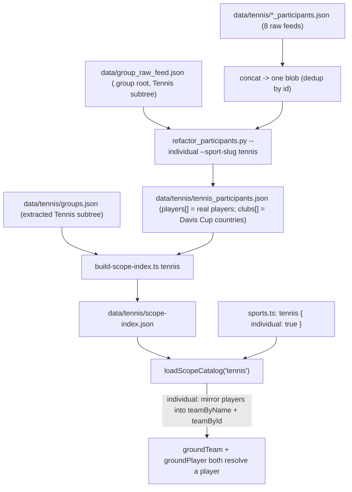

# Add tennis as a third grounded sport

The Stage 2/3 wiring (sport-keyed build, catalog, grounder, routing) is already generic — adding a sport is mostly **data decoration**. But tennis is the first **individual sport**, and that breaks assumptions baked into the football/basketball path. So this plan is: **(1) Data decoration plus three small `--individual` edits to the normalizer** (player source = top-level PARTICIPANTs, fold tour-group ids into `competitionIds`, exempt clubless players from the noise filter); **(2) one small app-code change** — an `individual` catalog shape (mirror players into the team index) so a player grounds whether the extractor calls it a team or a player. No extractor-prompt change (verified — see Key facts).

## Key facts established (verified against the real feeds)

- **Tennis players are top-level `PARTICIPANT` entries, not `TEAM` rosters.** `data/tennis/ATP_participants.json` has 1190 entries: **1066 `PARTICIPANT`** (the real players — Djokovic, Alcaraz, …, each `teamMembers: 0`, `team: false`), **16 `TEAM`** (Davis-Cup-style country teams: Sweden/Australia/France, 15–18 members each), **108 `LABEL`** (market noise: "4-6", "Under 13.5").
- **The current normalizer would import zero real players.** `refactor_participants.py:502` skips every entry where `type != "TEAM"` and pulls players only from `teamMembers`. Run as-is on tennis, it emits the 16 country teams + their members and drops all 1066 ATP players. A plain re-run is useless — the normalizer needs an individual-sport ingest path.
- **The "teams" slot is really "the sides that pick the fixture."** In football those are always clubs; in tennis they are players. The extractor tags a tennis match participant inconsistently by phrasing (probe, 6 queries):
  - "Djokovic to win" → `subject.kind=player` (name=Djokovic) ✓
  - "Alcaraz to win Wimbledon" → `subject.kind=player`, `competition="Wimbledon"` ✓
  - "Sinner to win the first set" / "Medvedev aces over 10.5" → `subject.kind=player`
  - "Swiatek to beat Gauff" → opponent in **`scope.players`**
  - "Djokovic vs Alcaraz total games over 22.5" → event subject, both in **`scope.teams`**
  - So the subject is reliably a player, but the *opponent / fixture-definer* lands in `scope.teams` OR `scope.players` depending on wording. This is "same intent, many surface forms" — fix it where the facts are concrete (the data), not by branching in the prompt. **No prompt rule needed; the extractor already emits `sport: "tennis"` as free text** and `otherSports` works unchanged.
- **Players reference real, in-tree comp nodes — but `classify` splits them two ways.** A player's `groupIds` is a long flat list; most are deep weekly-event nodes absent from the shallow `group_raw_feed.json` tennis subtree. Of the in-tree ones, the **13 tour nodes — ATP (1000093324), WTA (1000093904), Grand Slam (1000093528), Challenger (1000093377), ITF Men/Women, UTR …** — all have children, so `classify` calls them **`group`**, not `competition`; `split_group_ids` returns them in its *groups* half, which the football player record discards. Only the Grand-Slam **leaves — Wimbledon (1000096467), US Open (1000096466)** (depth-3, no children) — classify as `competition` and resolve out of the box (verified: Djokovic's in-tree refs are Wimbledon/US Open/Eastbourne as comps + ATP/Grand Slam/Challenger as groups). So **the tour nodes need the explicit fold in Stage 1 step 2** — without it `groundCompetition("ATP")` returns nothing. Same shallow-tree situation basketball accepted; fine for v1.
- **Tennis subtree exists** in `data/group_raw_feed.json`: root **`1000093193`** ("Tennis"), 13 children (ATP, WTA, ATP Doubles, WTA Doubles, Grand Slam, Challenger, ITF Men, ITF Women, Challenger Doubles, ITF Men Doubles, ITF Women Doubles, UTR Pro Tennis Series, UTR Pro Tennis Series Women).
- **8 feeds** in `data/tennis/`: `ATP`, `WTA`, `GS` (Grand Slam), `CD`, `ITFM`/`ITFW` (ITF Men/Women), `UTRM`/`UTRW` (UTR Men/Women). All shape `{ participants[], range }`.
- **Letting a player resolve as a "team" is side-effect-free.** A tennis player has `clubId=null`/`countryTeamId=null` and is not a roster key, so the grounder's "confident team scopes the player pool" (homonym cut) and `plan-recall`'s competition-grain squad injection both no-op for them. No over-fetch.

## Data flow (target state)



## Stage 1 — Data decoration

Goal: produce `data/tennis/tennis_participants.json` with the 1066+ real players, plus the per-sport scope inputs.

1. **Concat the 8 feeds into one blob.** Add `scripts/tennis/concat-feeds.ts` mirroring `scripts/basketball/concat-feeds.ts` (union all `data/tennis/*.json` by participant id, first-occurrence dedup, SKIP the output artifacts). Output `data/tennis/tennis_participants_raw.json` (add it to `.gitignore` like the basketball intermediate). Confirm all **8** files union.

2. **Add an individual-sport mode to the normalizer** (`scripts/football/refactor_participants.py`). New flag `--individual`. Three changes, all gated on the flag so the football/basketball path is byte-for-byte unchanged:
   - **Player source = the top-level `PARTICIPANT` pass, not the `TEAM` members.** Iterate top-level `PARTICIPANT` entries; emit each as a **player** record `{ id, name, clubId: null, countryTeamId: null, competitionIds, sport }`. Keep the `TEAM` loop but in individual mode it builds **`clubs[]` only** (the 16 Davis-Cup countries → "Sweden" grounding); do NOT also emit its `teamMembers` as players. This avoids the double-emit: 5 of Sweden's 15 members are also top-level `PARTICIPANT`s, so running both loops writes the same id twice with conflicting `clubId`. Cost: ~10 doubles-only names per country dropped — fine for singles v1.
   - **Fold the group half into `competitionIds`.** `split_group_ids` returns `(comps, groups)`. Set `competitionIds = sorted(set(comps) | (set(groups) - {sport_root_id}))`, with the allowlist = **all in-tree group nodes** (`{gid for gid, n in group_index.items() if classify(n) == "group"}`; no home-country anchor — players have no club). Without the fold the tour nodes (ATP/WTA/Grand Slam — all `group`-kind) are silently dropped; widening the allowlist alone does NOT move them into `competitionIds`, it only lets them survive into the discarded `groups` half. **Verify after the build that ATP/WTA/Grand Slam appear in `scope-index.json` groups[].**
   - **Exempt clubless players from the `_remove_noise` club filter.** `refactor_participants.py:418` keeps only players whose `clubId` is in the surviving club set — with `clubId: null` that drops ALL 1066. Change to `if p["clubId"] is None or p["clubId"] in surviving_ids`. Harmless to football (its players always have a real `clubId`). The other club-coupled lines (name-prefix, dup-by-clubId) already no-op safely on a `None` clubId.
   - Re-use `normalise_player_name` / `pick_en_name` / `split_group_ids` unchanged. The football-only heuristics (NT name back-fill, `MARKET_NAMES_LITERAL`, friendly-only drop) are skipped or inert in individual mode.

   Run:
   ```bash
   python3 scripts/football/refactor_participants.py \
     --groups data/group_raw_feed.json \
     --participants data/tennis/tennis_participants_raw.json \
     --individual --sport-label TENNIS --sport-slug tennis \
     --out data/tennis/tennis_participants.json
   ```
   Validate with the jq gates (no LABEL/placeholder leakage, no dup player ids, every comp id resolves). **Spot-check by hand:** Djokovic, Alcaraz, Sinner, Swiatek resolve, each with ATP/WTA/Grand Slam in `competitionIds` (the fold) plus their Slam leaves.

3. **Extract `data/tennis/groups.json`** from `group_raw_feed.json`'s Tennis subtree (root `1000093193`, 13 children), same `{ id: 1, sport: "NOT-SPECIFIED", groups: [<tennis-root>] }` wrapper as basketball.

4. **Add `data/tennis/scope-aliases.json`** (three-table shape). Seed only comps **present in the current feed**: `atp`→ATP, `wta`→WTA, `grand slam`→Grand Slam (these work once step 2's fold lands), `wimbledon`→Wimbledon, `us open`→US Open. **Do NOT seed `french open`/`roland garros`/`australian open`** — those nodes aren't in the tree right now (seasonal; the June feed carries only Wimbledon + US Open under Grand Slam). Add them when the feed rotates them in. Per the alias-discipline rule, seed to bridge a real gap, not to point at comps that don't exist.

## Stage 2 — Individual-sport catalog shape (the one app-code change)

Goal: a player grounds whether the extractor routes it through `scope.teams`, `scope.players`, or `subject` — without touching the prompt and without bloating the artifact. **Option B (mirror at load), chosen over disk-duplication and over a prompt rule.**

5. **Add `individual?: boolean` to the sport registry** (`src/resolver/sports.ts`):
   - `tennis: { slug: "tennis", label: "TENNIS", sportRootId: 1000093193, participantsFile: "tennis_participants.json", individual: true }`
   - football/basketball omit it (falsey).

6. **Mirror players into the team index for individual sports** (`src/resolver/scope-catalog.ts`; needs `import { getSport } from "./sports"`). After the player loop, when `getSport(slug)?.individual`, index each player under BOTH `teamByName` AND `teamById`. The `teamById` entry is **required, not optional**: `groundTeam` does `cat.teamById.get(id)!.name` (`ground-scope.ts:190`), so a `teamByName` hit with no `teamById` view crashes. Push a `ScopeTeam`-shaped view `{ id, name, competitionIds: p.competitionIds, groupIds: [], ntVariant: null }` so `groundTeam("Djokovic")` resolves the same id as `groundPlayer("Djokovic")`. Don't add players to the `cat.teams` array (the exact-name path uses the maps; the token-subset fallback over `cat.teams` isn't needed here). Player ids and the 16 country-team ids don't collide, so no clobber. Keep the disk `scope-index.json` honest (players in `players[]`, the 16 countries in `teams[]`); the mirror is purely in-memory and gated by the registry flag. `plan-recall` dedups team+player ids via a `Set`, so the same id resolving in both slots fetches once.

7. **`package.json`:** add `build:scope:tennis` → `tsx src/resolver/build-scope-index.ts tennis`. Build the index.

## Validation

8. `npm run typecheck`; `npm run build:scope:tennis` (confirm groups[] includes ATP/WTA/Grand Slam; players in the thousands). Re-build football+basketball indexes to confirm no regression (versions unchanged).
9. Smoke `groundScope` on a synthetic tennis plan: "Djokovic" as `subject` (player path), as `scope.teams` (team path), and as `scope.players` — all three must return `confident` with the same id. Confirm `groundCompetition("ATP"/"Wimbledon")` resolves.
10. **One full end-to-end query to a `ResponseEnvelope`** (needs API + live feed): a match-winner ("Alcaraz to win") and a player prop ("aces over …") so recall → scopeMenu → resolveMarket → select → execute is exercised for tennis markets, not just entity grounding. The unbuilt-sport guard in `resolve.ts` flips off automatically once the registry entry + index exist.

## Out of scope (flag for follow-up)

Product-facing tennis limitations (doubles, Davis Cup, no country/region scoping) live in **[planning/limitations.md](limitations.md)** — add to that file, not here. Plan-specific deferrals:

- **Tennis eval / gold set** — none; quality is the manual smoke + the one end-to-end check (step 10). Broaden the smoke list to 10–15 names mixing stars with shared surnames (e.g. Novak vs Marko Djokovic) so within-tennis collisions surface before ship; step 2's now-working competition scope narrows surname pools ("ATP player X").
- **Duplicate humans (same player, two ids)** — the feed carries e.g. "Carlos Alcaraz" (1006148145) and "Carlos Alcaraz Garfia" (1004468831) as separate participants; `clubId: null` + differing name strings means nothing merges them, so a surname grounds ambiguous between them. Accepted for v1: both ids get fetched and the live menu drops the inactive one (no offers). If a smoke test shows the disambiguator picking the dead id, add a tiebreak preferring the larger `competitionIds`; don't build a name-merge step (risks merging real different people).
- **Cross-sport name collisions** — tennis adds player names that may collide with football/basketball (e.g. surnames). Handled by the existing Stage 3 `otherSports` routing; no new work unless a specific collision misroutes.
- **Competition-grain squad injection** — `plan-recall` injects a team's roster for competition-level legs; for a tennis "team" this no-ops (no roster). If a competition-grain tennis query ("most ATP titles") ever needs the full player pool, `roster[ATP]` (~all ATP players) could over-fetch — revisit then.
